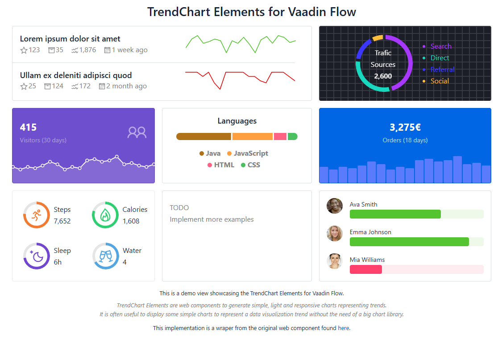

[](https://vaadin.com/directory/component/image-crop-add-on)
[](https://vaadin.com/directory/component/image-crop-add-on)
[](https://jenkins.flowingcode.com/job/ImageCrop-addon)
[](https://mvnrepository.com/artifact/com.flowingcode.vaadin.addons/image-crop-addon)


# TrendChart add-on for Vaadin Flow
WebLogin TrendChart Elements are web components to generate simple, light and responsive charts representing trends. It is often useful to display some simple charts to represent a data visualization trend without the need of a big chart library.

This implementation is a Vaadin Flow wraper from the original web component found [here](https://github.com/WebLogin/trendchart-elements) developed by [WebLogin](https://www.weblogin.fr/)


## Example Code
The followin code is extracted from `UsersSticker.java` in test directory
```java
public class UsersSticker extends Sticker {

    private Map<String, String> users;

    public UsersSticker() {
        users = Map.of(
                "Ava Smith", "https://images.unsplash.com/photo-1530785602389-07594beb8b73?&auto=format&fit=facearea&facepad=2&w=256&h=256&q=80",
                "Emma Johnson", "https://images.unsplash.com/photo-1553514029-1318c9127859?&auto=format&fit=facearea&facepad=2&w=256&h=256&q=80",
                "Mia Williams", "https://images.unsplash.com/photo-1580489944761-15a19d654956?&auto=format&fit=facearea&facepad=2&w=256&h=256&q=80");

        HorizontalLayout user1 = getChartItem(68, "Ava Smith", "#54C430");
        HorizontalLayout user2 = getChartItem(89, "Emma Johnson", "#54C430");
        HorizontalLayout user3 = getChartItem(24, "Mia Williams", "#FF416C");

        setAlignItems(Alignment.CENTER);
        add(user1, user2, user3);
    }

    private HorizontalLayout getChartItem(double value, String userName, String color) {

        // this object store the data for the StackTrendChart to draw
        StackChartData chartData = new StackChartData(List.of(value));
        chartData.max = 100;
        chartData.horizontal = true;
        chartData.radius = 4;
        chartData.gap = 3;

        // this is the actual trendchard element. a simple horizontal bar.
        StackTrendChart trendChart = new StackTrendChart(chartData);
        trendChart.setHeight("0.8rem");
        trendChart.setWidthFull();
        trendChart.setCssVariable(CssVariable.shape_color, color);
        trendChart.setCssVariable(CssVariable.residual_color, color);
        trendChart.setCssVariable(CssVariable.residual_opacity, 0.1);

        // colored text 
        Span name = new Span(userName);
        name.getStyle().set("font-size", "var(--lumo-font-size-s)");
        Div wrapper = new Div(name, trendChart);

        // user avatar
        String url = users.get(userName);
        Image image = new Image(url, userName);
        image.setWidth("2.2rem");
        image.setHeight("2.2rem");
        image.getStyle().set("border-radius", "50%");

        HorizontalLayout item = new HorizontalLayout(image, wrapper);
        item.setWidthFull();

        return item;
    }
}
```

Supported versions: Vaadin 24


## Download release
[Available in Vaadin Directory](https://vaadin.com/directory/component/image-crop-add-on)


## Maven install
Add the following dependencies in your pom.xml file:

```xml
<dependency>
   <groupId>org.vaadin.addons.terrytupano</groupId>
   <artifactId>trendchart-flow</artifactId>
   <version>X.Y.Z</version>
</dependency>
```

## Building and running demo
- git clone repository
- mvn jetty:run
- navigate to http://localhost:8080/ and you will see this

<p align="center">
    
</p>


## Contributions
Contributions are welcome. There are two primary ways you can contribute: by reporting issues or by submitting code changes through pull requests. To ensure a smooth and effective process for everyone, please follow the guidelines below for the type of contribution you are making.


## License & Author
This add-on is distributed under Apache License 2.0. For license terms, see LICENSE file.

TrendChart add-on for Vaadin Flow is written by Terry Tupano.